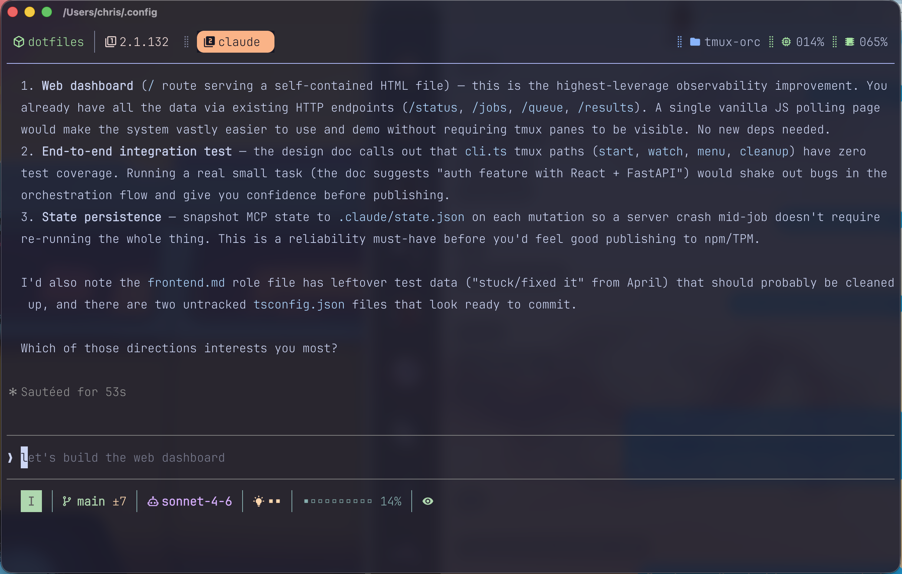

# Claude Code Config

Personal Claude Code setup with a custom statusline, a persistent diff review side pane, and vim mode integration.

## Statusline

`statusline.sh` is a custom status bar script driven by JSON piped from Claude Code. All colors use the Catppuccin Mocha palette.

Segments left to right:

| Segment | Description |
|---------|-------------|
| `N` / `I` / `V` / `VL` | Vim mode — blue (normal), green (insert), yellow (visual) |
| `󰘬 main ±3` | Git branch and uncommitted file count |
| `󱙺 sonnet-4-6` | Active Claude model |
| `󰾆 ■■■□` | Effort level — dimmed (low) → yellow (medium) → peach (high) → red (max) |
| `󰛨` | Extended thinking enabled — same color as effort level |
| `⚡` | Fast mode active (Max plan) |
| `▓▓░░░░░░░░ 15%` | Context window usage — color escalates yellow → peach → red above 50/75/90% |
| `󰈈` | Diff popup is on (only shown when enabled) |

Configured in `settings.json`:

```json
"statusLine": {
  "type": "command",
  "command": "~/.config/claude/statusline.sh",
  "hideVimModeIndicator": true
}
```

## Diff Review Side Pane

After Claude finishes a response, if any files were edited the side pane updates automatically. Open it with `prefix+P` — two panes appear on the right: changed files on top, delta diff preview below. Navigate files with arrow keys. Use `prefix+z` to zoom any pane full screen.

### How it works

1. **`hooks/snapshot-file.sh`** — `PreToolUse` hook. Saves a snapshot of each file before Claude edits it.
2. **`hooks/track-changes.sh`** — `PostToolUse` hook. Records edited file paths to `/tmp/claude-changes-{session_id}`.
3. **`hooks/diff-popup.sh`** — `Stop` hook. Reads tracked files, signals the preview pane if open, otherwise falls back to a tmux popup.
4. **`hooks/preview-open.sh`** — creates the two-pane right column layout.
5. **`hooks/preview-list.sh`** — top pane. Shows changed files, handles keyboard navigation, writes selected file to a shared target.
6. **`hooks/preview-diff.sh`** — bottom pane. Watches the shared target and rerenders delta diff on selection change.
7. **`hooks/diff-preview.sh`** — diff renderer. Diffs snapshot vs current file; falls back to HEAD diff or full content for new files.

### Keybindings in the preview pane

| Key | Action |
|-----|--------|
| `↑` / `k` | Previous file |
| `↓` / `j` | Next file |
| `enter` | Open selected file in nvim |
| `q` | Clear and return to waiting state |

### Tmux bindings

| Binding | Action |
|---------|--------|
| `prefix+P` | Open preview panes (or unzoom if already open) |
| `prefix+D` | Toggle fallback popup mode on/off |
| `prefix+z` | Zoom focused pane full screen |

## Gallery



## AI-Helpful CLI Tools

Tools installed to give Claude better ways to read, search, and modify code.

| Tool | Install | Purpose |
|------|---------|---------|
| **difftastic** | `brew install difftastic` | Structural diff — understands syntax trees so diffs show what logically changed, not just line deltas. Great for reviewing refactors. |
| **ast-grep** | `brew install ast-grep` | AST-aware code search and rewriting. Like grep but understands code structure — find patterns across languages without regex hacks. |
| **shellcheck** | `brew install shellcheck` | Static analysis for shell scripts. Catches bugs, bad practices, and portability issues before they cause problems. |
| **sd** | `brew install sd` | Simpler, faster `sed` replacement for find-and-replace. Supports regex and literal strings with cleaner syntax. |
| **scc** | `brew install scc` | Fast code counter (lines, blanks, comments, complexity). Gives a quick codebase overview without cloning context. |
| **yq** | `brew install yq` | `jq` for YAML, JSON, TOML, and XML. Useful for reading and editing config files in pipelines. |

## Dependencies

- `jq` — JSON parsing in statusline and hooks
- `fzf` — file picker in the diff popup
- `delta` — diff renderer (uses your git config theme automatically)
- `tmux` — required for the popup; falls back to inline fzf otherwise
- Nerd Fonts — required for all icons in the statusline

## File Structure

```
~/.config/claude/
├── settings.json          # theme, vim mode, statusline, hooks
├── statusline.sh          # custom status bar script
├── hooks/
│   ├── track-changes.sh   # PostToolUse: record edited files
│   ├── diff-popup.sh      # Stop: launch the tmux popup
│   ├── diff-viewer.sh     # fzf file picker with preview
│   └── diff-preview.sh    # delta diff renderer for fzf preview
├── flags/
│   └── diff-popup         # exists = popup enabled (toggled by claude_diff)
└── memory/                # persistent memory across sessions
```
